# 🩺 CareReach

*Find India's real, highest-risk maternal-care gaps — and know which you can trust.*

**Databricks Apps & Agents for Good Hackathon 2026 — Track 2 (Medical Desert Planner)**

A non-technical planner asks, in plain language (or by **voice, in their own Indian language**) —
*"Where in Bihar should we deploy a mobile maternal-health unit?"* — and gets a **ranked,
evidence-backed, uncertainty-aware** answer they can save and revisit. CareReach surfaces
**maternal-care deserts**: regions with high health burden and low *verified* facility coverage —
without ever confusing a real desert for a region we're simply **data-poor** about.

**Live app:** https://mdp-planner-7474654025962366.aws.databricksapps.com

---

## The core idea: two signals, never collapsed

Most "desert finders" collapse *need* and *evidence* into one score, so a region with no data looks
identical to a confirmed gap. CareReach refuses to. Every region gets **two independent signals**:

- **Maternal-care gap** — how underserved it is (NFHS-5 health burden + low *verified* obstetric coverage).
- **Evidence confidence** — how much verified facility evidence backs that gap (facility count, share of
  high-confidence claims, geocoding quality, evidence quotes).

Plotted as a **2×2**, that yields an honest, actionable map:

| | Low evidence confidence | High evidence confidence |
|---|---|---|
| **High gap** | 🟠 **DATA-POOR** — investigate first, *don't deploy blindly* | 🔴 **REAL desert** — act |
| **Low gap** | — | 🟢 adequately served |

*Example (Bihar, district level): 22 REAL deserts, 15 DATA-POOR, 1 served. Araria looks like the
worst desert by burden but has **0 facilities on record** → flagged DATA-POOR. Saharsa/Madhepura have
the evidence to back the gap → REAL deserts, act.*

---

## What it does

Over a 10,000-facility India health directory enriched with India-Post PIN geography and NFHS-5
district health indicators, CareReach builds a governed medallion pipeline, **treats noisy scraped
capability text as claims (not facts)**, verifies those claims with an LLM auditor + Vector Search,
computes the two signals for every region, and serves it through a hosted app with a 2×2 quadrant,
an evidence drawer, per-region honesty banners, and a multilingual voice question box. Planners save
deployment plans (with the agent's recommendation) to serverless Postgres.

### The four challenge requirements

| Requirement | How it's met |
|---|---|
| **Extract structure** | `ai_query` (JSON-schema) turns free-text `description`/`capability`/`equipment`/`procedure` into typed capability flags + confidence (`mdp.silver.facility_claims`) |
| **Show evidence** | Every flag drills down to the facilities, **verified / claimed-but-unverified / no-claim** badges, an LLM verdict & confidence (`fn_verify_capability`), and the **verbatim source sentence** |
| **Communicate uncertainty** | The two-signal model itself; per-region honesty banners (% inferred geography, % high-confidence claims, % with evidence quote); coverage counts **verified** facilities only |
| **Persist their work** | **Lakebase** (serverless Postgres): saved deployment plans + the agent recommendation; sessions, scenarios, evidence trail, reviewer overrides |

### Generalizes beyond maternal care

Maternal & newborn is the **live** vertical (a *Care domain* selector makes this explicit). The engine
is **specialty-agnostic** — the same LLM extraction → per-claim verification → two-signal scoring works
for any service line. Maternal is live because **NFHS-5 supplies real district-level burden** to ground
demand; adding general surgery, pediatrics, or cardiac care is a matter of wiring in that domain's
burden signal — *no rewrite* of extraction, verification, or scoring. The app shows the non-maternal
domains as an honest roadmap state rather than maternal numbers under the wrong label.

---

## The app — design & experience

A single hosted Streamlit app, designed so a **non-technical planner** gets the answer without
reading a manual — and so the visuals never overpower the data.

- **India-themed, production-clean UI** (`src/app/theme.py`): a tricolor hero with the **Ashoka
  Chakra**, an **ambulance** motif, and a faint **India-map watermark**; saffron-top/green-bottom
  page tint and green-railed metric cards. All kept at low opacity so the 2×2 and tables stay
  fully legible.
- **Primary view = the 2×2 quadrant** (Altair), not a single choropleth — care gap × evidence
  confidence, with threshold lines and a color per quadrant, so *real deserts* and *data-poor*
  regions are visually distinct at a glance. Three count cards (REAL / DATA-POOR / served) sit above it.
- **Sidebar controls:** **Care domain** (specialty) selector · **Geography level**
  (state / city / district / pincode) · **state filter**.
- **Drill-down** for any region: the two scores + raw counts, a **per-region honesty banner**
  (% inferred geography, % high-confidence claims, % with an evidence quote), a REAL-vs-DATA-POOR
  verdict, and the underlying facilities with **verified / claimed-but-unverified / no-claim**
  badges and the **verbatim source sentence**.
- **Ask the deployment planner** — type a question, or **speak it in an Indian language**; the app
  shows *Heard (lang) → English* and feeds the grounded answer.
- **Save / load deployment plans** to Lakebase (the agent's recommendation travels with the plan).
- A **"How CareReach maps to the brief"** expander makes the four pillars + Databricks stack explicit
  for reviewers.

## Architecture

```mermaid
flowchart LR
  subgraph Sources["Marketplace share (Delta Sharing)"]
    F[facilities 10k]; P[India Post PIN 165k]; N[NFHS-5 706 districts]
  end
  subgraph Bronze[mdp.bronze]
    BF[facilities]; BP[pincode]; BN[nfhs5]; BB[district_boundaries · geoBoundaries ADM2]
  end
  subgraph Silver[mdp.silver]
    SC[facility_claims · ai_query]; SF[facility · ST_Contains district]
    SP[pincode_district · deduped]; SN[nfhs5_district · cleaned]; SDB[district_boundaries · GEOMETRY]
    VS[(facility_vs_index · Vector Search)]
  end
  subgraph Gold[mdp.gold]
    GF[facility · verified flags + evidence]
    RS["region_signals · care_gap × evidence_confidence (per region · per geo level)"]
    FN["UC functions fn_* (geo · desert · verify · search)"]
  end
  subgraph Agents
    GENIE[Genie Space]; SUP[Agent Bricks Supervisor]
  end
  APP["Hosted Databricks App · Streamlit<br/>2×2 · drill-down · voice (translate) · save plan"]
  LB[(Lakebase · Postgres)]

  Sources --> Bronze --> Silver --> Gold
  SC --> VS
  Gold --> FN --> SUP
  GENIE --> SUP
  RS --> APP
  FN --> APP
  APP --> LB
  SUP --> APP
```



**Medallion:** bronze (raw Delta) → silver (AI extraction, pincode dedup to district grain, NFHS
cleaning with `*`→NULL, `ST_Contains` spatial join to geoBoundaries ADM2, Vector Search index) →
gold (`facility`, **`region_signals`** — the two-signal table, per region per geo level: state/city/district/pincode).

**Signals** (per `AGENTS.md`): **care_gap_score** (district = `0.5·burden + 0.35·(1 − verified_coverage)
+ 0.15·accessibility`; coverage counts only verified-obstetric facilities) and **data_confidence_score**
(`0.40·count + 0.25·high_conf_share + 0.20·geocoded_share + 0.15·evidence_share`), all min-max normalized.
Quadrant thresholds: gap ≥ 0.66, confidence ≥ 0.45.

---

## Data preparation (bronze → silver → gold)

The hard part of this challenge is the data, not the model. Here's how the messy inputs become a
table a planner can trust. *(SQL in `src/pipelines/{bronze,silver,gold}`; every layer is gated by
`tests/*_assertions.sql`.)*

### Profiling first (what the raw data actually is)
- **facilities** — 10,088 rows × 51 cols, but **global**: exactly **10,000 are `countryCode='IN'`**, and
  ~88 rows are garbled/misaligned from CSV quote-bleed → silver filters to India and quarantines bad rows.
- Structured coverage is **sparse and uneven**: `capacity` ~25% numeric, `yearEstablished` ~47% valid,
  `numberDoctors` ~36% — so these are treated as hints, never hard inputs.
- The capability fields (`specialties`/`procedure`/`equipment`/`capability`) are **JSON arrays of free
  text** with duplicates and empty entries — the "claims, not facts" surface.
- **NFHS-5** ships many `*_pct` columns as *strings* with `*` for suppressed/small-sample values.
- The dataset has **no district polygons** → we bring in external **geoBoundaries** India ADM2.

### Bronze — faithful raw landing
- `facilities` (10,088×51), `pincode` (India Post, 165,627), `nfhs5` (706×109), and `district_boundaries`
  (geoBoundaries ADM2, 735 polygons). Idempotent `CREATE OR REPLACE`; row/column-count assertions.

### Silver — clean + structure (the heavy lifting)
- **AI claim extraction** — `ai_query` (`gemini-3-5-flash`, JSON-schema) turns each India facility's free
  text into typed flags (`obstetrics`, `csection`, `icu`, …) **each with a confidence** → `facility_claims`
  (10,000 rows). Gated by a 30-facility hand-label check (≥80% agreement) before anything builds on it.
- **NFHS cleaning** — `nfhs5_district` (706): `*` → `NULL` (never 0), 49 percentage columns cast to numeric,
  small-sample estimates flagged low-confidence, keys normalized.
- **PIN dedup before any join** — the directory's grain is *post office*, not PIN; collapsed from 165,627
  rows to **19,586 unique pincodes** at district grain to prevent join fan-out.
- **Spatial attribution** — each facility placed in a district via `ST_Contains(polygon, st_setsrid(st_point(lon,lat),4326))`,
  with a **pincode fallback** when coordinates are missing; rows are flagged `geo_inferred` (~0.38%) — never dropped.
- **Dedup** — 11 duplicate `unique_id`s in the source are collapsed via `QUALIFY` → **9,989 unique facilities**.
- **Vector Search source** — `facility_search` carries a **self-managed 1024-dim `gte-large-en` embedding**
  (precomputed with `ai_query`), with Change Data Feed + 30-day retention.

### Gold — decision-ready
- `facility` (9,989) — verified capability flags + evidence pointer (source record + claim sentence).
- **`region_signals`** — the two-signal table, **one row per region per geo level** (pincode/city/district/state),
  built on the **NFHS 706-district spine** (181 districts have zero facilities — exactly the data-poor case).
  **District-name harmonization** via state+district alias maps reaches **~98% facility attribution**.
- **Fan-out fix** — bronze is deduped to one row per `unique_id` *before* the city/pincode joins, so the
  region grain matches `gold.facility` (9,989) instead of inflating; verified by `tests/region_signals_assertions.sql`.
- **Claim verification** — `fn_verify_capability` adjudicates a claim against the facility profile
  (`ai_query`): in a spot-check, 15 C-section-claimed facilities → 14 credible / 1 uncertain / 0 false-positive,
  and an eye hospital claiming C-sections is correctly marked **not-credible**.
- **Result (national, district level):** **194 REAL deserts · 206 DATA-POOR · 306 adequately served** — the
  data-poor bucket (avg 0.8 facilities, 0.10 confidence) is precisely what a single-score tool would mislabel.

---

## Voice & translation — how it works

A planner can ask by voice in their own Indian language. The flow spans three places — the browser,
a speech recognizer, and Databricks — with a clear trust boundary (code in `src/app/app.py`):

```
You speak → [browser captures audio] → [transcribe to native text] → [translate to English on Databricks] → [grounded answer]
 (Hindi)      streamlit-mic-recorder       free speech recognizer          llama-3-3-70b chat endpoint        over region_signals
```

1. **Pick the language** — the dropdown maps to a BCP-47 code (`Hindi → hi-IN`, `Bengali → bn-IN`, …),
   telling the recognizer what to expect.
2. **Capture (browser)** — `mic_recorder` records in Chrome/Edge and returns WAV bytes + a recording id;
   nothing leaves the browser until you hit Stop. The app acts only on a *new* recording id.
3. **Transcribe to native text** — `transcribe_audio()` runs the audio through a free speech recognizer
   for the chosen language, inside a spinner; a failed clip shows a "try again" prompt, never silence.
4. **Translate on Databricks** — `translate_to_english()` calls the **chat-completions endpoint**
   (`llama-3-3-70b`) with a **system** message ("translation engine — output only the English, don't
   answer it") + the native text as the **user** message. The system/user split is what stops the model
   from *answering* the question instead of translating it.
5. **Show & answer** — the app displays *Heard (lang): … → English: …*, fills the question box, and feeds
   the same grounded planner path used everywhere else (`mdp.gold.region_signals`).

**Trust boundary:** browser = capture only; the *speech-to-text* step uses a free best-effort recognizer
(the one non-Databricks dependency); **translation and the answer both run on Databricks** (text only, no
audio). Production would swap step 3 for a hosted Whisper endpoint — the rest is unchanged. Note: the
dropdown language must match what's spoken, and short clear sentences transcribe most reliably.

## Databricks technologies & models

**Platform & governance**
- **Unity Catalog** — catalog `mdp`, schemas (bronze/silver/gold/ops), volume, **UC functions**, grants (incl. app service-principal grants)
- **Delta** tables · **Lakeflow Jobs** (bronze_ingest / silver_transform / gold_build)
- **Declarative Asset Bundles** with the **direct deployment engine** (Terraform-free; required for UC resources)

**Data & geospatial**
- **Marketplace / Delta Sharing** source (Virtue Foundation DAIS 2026 dataset)
- **Geospatial SQL** — `ST_Point` / `ST_Contains` / `ST_GeomFromGeoJSON` (GEOMETRY, SRID 4326) for facility→district attribution
- Open data: **geoBoundaries** India ADM2 (CC-BY), **NFHS-5**, **India Post** PIN directory

**AI & agents**
- **AI Functions** `ai_query` with structured **JSON-schema** output — capability extraction & per-claim verification
- **Mosaic AI Vector Search** (self-managed embeddings) for semantic claim/facility search
- **Agent Bricks Supervisor** + **Genie Space** + scalar **UC function tools** (`fn_verify_capability`, `fn_search_facilities`, `fn_worst_deserts`, `fn_district_summary`, `fn_point_to_district`)
- **Models:** silver extraction/verification built with **`databricks-gemini-3-5-flash`**; the live app's planner answer + native-language translation use **`databricks-meta-llama-3-3-70b-instruct`** via the **chat-completions endpoint** (system/user roles) — *premium endpoints are rate-limited to 0 on this Free Edition workspace*; embeddings via **`databricks-gte-large-en`**

**App, voice & persistence**
- **Databricks Apps** — hosted **Streamlit** (`databricks-sdk`, Statement Execution API, **Altair** 2×2, **pandas**)
- **Voice & multilingual** — in-browser capture (`streamlit-mic-recorder`, Chrome/Edge) → transcript → governed translation on Databricks → planner
- **Lakebase** (serverless Postgres) — saved plans/sessions/evidence via `psycopg2`, authenticated with a minted **OAuth database credential** (no static password)
- India map outline (**mapsicon**, CC) used in the themed UI

### Engineering decisions (the *why*)

The choices behind the stack — each was a real trade-off, not a default:

- **Direct deployment engine** (`DATABRICKS_BUNDLE_ENGINE=direct`) — Terraform-free. Required for UC
  catalog resources, and sidesteps the CLI's Terraform `openpgp: key expired` download failure.
- **`ai_query` model choice was benchmarked**, not assumed: `gemini-3-5-flash` extracted 10k facilities
  in ~5 min; `gpt-oss-120b` projected ~4.7 hr; `llama-3.1-8b` was fast but **over-claimed** (e.g. 60% C-section).
  A 30-facility hand-labelled gate (≥80% agreement) had to pass before building gold on the claims.
- **Self-managed Vector Search embeddings** — precomputing embeddings with `ai_query` (~7 min) instead
  of delta-sync auto-embed (~1 row/s ≈ 3 hr); the index then ingests in ~40 s.
- **Two signals, never collapsed** — the headline design call: scoring *need* and *evidence* separately
  is what prevents a data-poor region from masquerading as a confirmed desert.
- **Scalar UC functions for agent tools** — Agent Bricks can't register table-valued functions, so the
  tools are scalar `*_json` wrappers (TVFs kept for Genie/SQL).
- **Chat-completions with system/user roles** (not a single `ai_query` string) — role separation stops
  the model from *answering* a translated question instead of translating it, and fixed a regression
  when premium endpoints were disabled (switched the live path to `llama-3-3-70b`).
- **Lakebase auth without static passwords** — the app mints a short-lived **OAuth database credential**
  and connects as the service principal's own federated Postgres role (token identity), with explicit DML grants.
- **Fan-out guards** — the PIN directory is post-office-grain and the bronze facilities had duplicate
  IDs; both are deduped *before* joins so the silver/region grain stays correct (verified by SQL assertions).
- **Honest geography** — facilities without coordinates are `ST_Contains`-failed → pincode fallback →
  flagged `geo_inferred`, never dropped or presented as exact; district names harmonized via alias maps (~98% attribution).

**Project write-up (≤500 chars):**
> CareReach turns a noisy 10k-facility India directory + NFHS-5 + PIN geography into a governed
> medallion pipeline on Databricks. AI extracts capability *claims*; an LLM auditor + Vector Search
> verify them. Two never-collapsed signals — maternal-care gap × evidence confidence — separate real
> deserts from data-poor regions. A hosted app maps them, cites evidence, takes voice questions in
> Indian languages, and saves plans to Lakebase. Specialty-agnostic; maternal is the grounded vertical.

---

## How it maps to the judging criteria

| Criterion | CareReach |
|---|---|
| **Business Applicability** | Maternal mortality in high-burden states (Bihar/UP) is an urgent, real planning problem; the output mirrors how planners already think in *medical deserts*, and produces a saveable deployment plan. |
| **Data Relevance** | Combines all three provided/enrichment datasets (facility directory + India-Post PIN + NFHS-5) plus geoBoundaries, across a governed medallion pipeline, with `ai_query`, Vector Search, geospatial SQL, Agent Bricks, Lakebase, and a hosted App. |
| **Creativity** | **Two never-collapsed signals** (gap × evidence confidence) so a *data-poor* region is never mislabeled a confirmed desert — plus native-language voice questions. |
| **Thoroughness** | Drill-down to verbatim evidence, per-region honesty banners, verified/claimed/no-claim badges, an in-app "maps to the brief" guide, and tested multilingual outputs (`docs/voice_demo_questions.md`). |
| **Well-Architected** | Reproducible from a clean clone via one bundle; specialty-agnostic engine (add a domain = wire its burden signal, no rewrite); linear-cost SQL/`ai_query`, no bespoke infrastructure. |

## Run it from a clean clone

### Prerequisites
- Databricks CLI ≥ 0.287.0, Python ≥ 3.11, `uv`.
- Set the direct engine for every bundle command: `export DATABRICKS_BUNDLE_ENGINE=direct`
  *(Required for UC resources; also avoids the CLI's Terraform `openpgp: key expired` issue.)*
- **Auth:** `databricks auth login --host https://dbc-d2cc8242-7697.cloud.databricks.com -p mdp`
  (pass `-p mdp` to bundle commands).

### Manual one-time steps (platform constraints, documented)
1. **Create the `mdp` catalog in the UI** — this metastore uses UC **Default Storage**, which is
   UI-only to create (API/CLI/SQL rejected). Catalog Explorer → Create catalog → `mdp` → Standard.
2. **Add the source data from Marketplace** — get the *Virtue Foundation DAIS 2026* dataset
   (recreates `databricks_virtue_foundation_dataset_dais_2026`).
3. **Fetch district polygons:** `python3 src/pipelines/bronze/fetch_geoboundaries.py --profile mdp`.
4. **Genie Space + Agent Bricks Supervisor:** follow `docs/agents_setup.md` (UI; no provisioning API).

### Deploy & build
```bash
export DATABRICKS_BUNDLE_ENGINE=direct
databricks bundle validate -t dev -p mdp
databricks bundle deploy  -t dev -p mdp           # UC catalog scaffolding, jobs, Lakebase, app
databricks bundle run bronze_ingest    -t dev -p mdp   # land 3 source tables
databricks bundle run silver_transform -t dev -p mdp   # AI extraction, spatial, claims  (~10 min)
databricks bundle run gold_build        -t dev -p mdp  # facility + region_signals
# Vector Search index + Lakebase migration: see docs/agents_setup.md and src/db/migrate.py
databricks bundle run mdp_app -t dev -p mdp            # start the hosted app
```

### Demo path (~2 min)
1. Open the app → **Care domain = Maternal & newborn**, **Bihar**, district level.
2. Read the 2×2: **22 REAL deserts** (top-right) vs **15 DATA-POOR** (top-left).
3. Drill into **Araria** → 0 facilities → flagged **DATA-POOR (investigate)**. Then **Saharsa /
   Purba Champaran** → facilities on record, few verified → **REAL desert (act)**.
4. Expand a facility → verified/unverified badges + the **verbatim claim** (claims, not facts).
5. **Ask the planner** — by voice in Hindi: *"बिहार में मोबाइल मातृ स्वास्थ्य इकाई कहाँ भेजें?"* →
   transcribed, translated, answered (recommends real deserts, flags data-poor).
6. **Save the plan** → reload → it persists in **Lakebase**.

*(Full multilingual question set + tested outputs: `docs/voice_demo_questions.md`.)*

---

## Repo layout
- `databricks.yml`, `resources/` — bundle (catalog, jobs, lakebase, app)
- `src/pipelines/{bronze,silver,gold}` — SQL transforms · `src/agents/uc_functions.sql` — agent tools
- `src/db/` — Lakebase schema + migrate · `src/app/` — Streamlit app (`app.py`, `theme.py`)
- `tests/` — SQL assertions (bronze/silver/gold/region_signals) · `docs/` — agents setup, demo script, voice questions
- `AGENTS.md` — project brief & contracts · `proj.md`, `runbook.md` — design & phased build

## Known caveats (honest)
- **Premium models** (gemini/claude) are rate-limited to 0 on this Free Edition workspace, so the
  live app uses `databricks-meta-llama-3-3-70b-instruct`; the silver extraction tables were built
  with gemini and persist in Delta.
- **Voice** transcription uses the browser + a free best-effort recognizer (Chrome/Edge, mic permission);
  a failed clip shows a retry prompt. Translation is governed on Databricks. Production would swap in a
  hosted Whisper endpoint.
- The app's planner answer uses the deterministic grounded path; the Agent Bricks supervisor is best
  demoed in its playground (the `agent/v1/responses` stream isn't captured by the simple app client).
- District name harmonization (geoBoundaries ↔ NFHS) reaches ~98% facility attribution via alias maps;
  a few duplicate-named districts remain approximate.

## License

Code is released under the **MIT License** (see [`LICENSE`](LICENSE)).

Third-party data & assets, used under their own terms:
- **geoBoundaries** India ADM2 boundaries — CC-BY 4.0.
- India map outline (**mapsicon**) — CC.
- **NFHS-5** district indicators and **India Post** PIN directory — public open data.
- Facility directory — *Virtue Foundation DAIS 2026* dataset, used per the hackathon terms.
