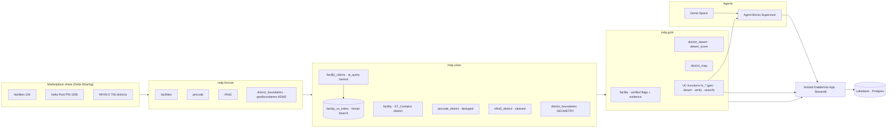

# 🩺 Medical Desert Planner

**Databricks Apps & Agents for Good Hackathon 2026 — Track 2**

A non-technical planner asks, in plain language — *"Where in Bihar should we deploy a mobile
maternal-health unit?"* — and gets a **ranked, evidence-backed, uncertainty-aware** answer they
can save and revisit. The app surfaces **medical deserts**: districts with high health burden and
low *verified* facility coverage.

**Live app:** https://mdp-planner-7474654025962366.aws.databricksapps.com

---

## What it does

Over a 10,000-facility India health directory enriched with India-Post PIN geography and NFHS-5
district health indicators, it builds a governed medallion pipeline, **treats noisy scraped
capability text as claims (not facts)**, verifies those claims with an LLM auditor + Vector
Search, scores every district for "maternal-care desert," and serves it through a hosted app with
a map, an evidence drawer, and an honesty banner. Planners save scenarios to serverless Postgres.

### The four challenge requirements

| Requirement | How it's met |
|---|---|
| **Extract structure** | `ai_query` (Gemini, JSON-schema) turns free-text `description`/`capability`/`equipment`/`procedure` into typed capability flags + confidence (`mdp.silver.facility_claims`) |
| **Show evidence** | Every recommendation cites the source record + the exact claim sentence + an LLM verdict & confidence (`fn_verify_capability`); evidence drawer in the app |
| **Communicate uncertainty** | Honesty banner (field coverage, % inferred geography); per-claim confidence; coverage counts **verified** facilities only; NFHS small-sample flags |
| **Persist their work** | Lakebase (serverless Postgres): sessions, scenarios, evidence trail, reviewer overrides |

---

## Architecture



**Medallion:** bronze (raw Delta) → silver (AI extraction, pincode dedup to district grain, NFHS
cleaning with `*`→NULL, `ST_Contains` spatial join to geoBoundaries ADM2, Vector Search index) →
gold (`facility`, `district_desert`, `district_map`).

**Desert score** (per `AGENTS.md`): `0.5·burden + 0.35·(1 − verified_coverage) + 0.15·accessibility`,
all min-max normalized; **coverage counts only verified-obstetric facilities**.

---

## Databricks technologies & models

- **Unity Catalog** (catalog/schemas/volume/functions/grants), **Delta**, **Lakeflow Jobs**
- **Declarative Asset Bundles** + **direct deployment engine**
- **AI Functions** `ai_query` (structured JSON output) · **`databricks-gemini-3-5-flash`** (extraction & verification), **`databricks-gte-large-en`** (embeddings)
- **Mosaic AI Vector Search** (self-managed embeddings)
- **Geospatial** `ST_Point`/`ST_Contains`/`ST_GeomFromGeoJSON` (GEOMETRY, SRID 4326)
- **Genie Space**, **Agent Bricks Supervisor**, **UC function tools**
- **Lakebase** (serverless Postgres) · **Databricks Apps** (hosted Streamlit)
- Open data: **geoBoundaries** India ADM2 (CC-BY)

**Project write-up (≤500 chars):**
> Medical Desert Planner turns a noisy 10k-facility India directory + NFHS-5 + PIN geography into a
> governed medallion pipeline on Databricks. AI extracts capability *claims*; an LLM auditor +
> Vector Search verify them; a desert score (burden + verified coverage + access) ranks districts.
> A hosted app maps deserts, cites evidence, shows uncertainty honestly, and saves scenarios to
> Lakebase. Asks "where to send a mobile maternal unit?" → an evidence-backed answer.

---

## Run it from a clean clone

### Prerequisites
- Databricks CLI ≥ 0.287.0, Python ≥ 3.11, `uv`.
- Set the direct engine for every bundle command: `export DATABRICKS_BUNDLE_ENGINE=direct`
  *(Required for UC resources; also avoids the CLI's Terraform `openpgp: key expired` issue.)*
- **Auth:** `databricks auth login --host https://dbc-d2cc8242-7697.cloud.databricks.com -p mdp`
  (pass `-p mdp` to bundle commands).

### Manual one-time steps (platform constraints, documented)
1. **Create the `mdp` catalog in the UI** — this metastore uses UC **Default Storage**, which is
   UI-only to create (API/CLI/SQL rejected). Catalog Explorer → Create catalog → `mdp` → Standard.
2. **Add the source data from Marketplace** — get the *Virtue Foundation DAIS 2026* dataset
   (recreates `databricks_virtue_foundation_dataset_dais_2026`).
3. **Fetch district polygons:** `python3 src/pipelines/bronze/fetch_geoboundaries.py --profile mdp`.
4. **Genie Space + Agent Bricks Supervisor:** follow `docs/agents_setup.md` (UI; no provisioning API).

### Deploy & build
```bash
export DATABRICKS_BUNDLE_ENGINE=direct
databricks bundle validate -t dev -p mdp
databricks bundle deploy  -t dev -p mdp           # UC catalog scaffolding, jobs, Lakebase, app
databricks bundle run bronze_ingest    -t dev -p mdp   # land 3 source tables
databricks bundle run silver_transform -t dev -p mdp   # AI extraction, spatial, claims  (~10 min)
databricks bundle run gold_build        -t dev -p mdp  # facility + district_desert + district_map
# Vector Search index + Lakebase migration: see docs/agents_setup.md and src/db/migrate.py
databricks bundle run mdp_app -t dev -p mdp            # start the hosted app
```

### Demo path (2 min)
1. Open the app → select **Bihar**. Map lights up the worst maternal-care deserts.
2. Worst-5 = **Sitamarhi, Araria, Kishanganj, Purnia, Katihar** (Seemanchal — high burden, ~0 verified obstetric facilities).
3. Open a district → expand a facility → **Verify C-section** → LLM verdict + confidence + rationale.
4. Honesty banner shows verified-coverage % and inferred-geography %.
5. Save the scenario → reload → it persists in Lakebase.

---

## Repo layout
- `databricks.yml`, `resources/` — bundle (catalog, jobs, lakebase, app)
- `src/pipelines/{bronze,silver,gold}` — SQL transforms · `src/agents/uc_functions.sql` — agent tools
- `src/db/` — Lakebase schema + migrate · `src/app/` — Streamlit app
- `tests/` — SQL assertions (bronze/silver/gold) · `docs/agents_setup.md` — Genie/supervisor setup
- `AGENTS.md` — project brief & contracts · `proj.md`, `runbook.md` — design & phased build

## Known caveats (honest)
- **Save-to-Lakebase** binding is deferred until the app's service principal is provisioned as a
  Postgres role in `mdp-pg` (persistence itself is verified end-to-end).
- The app's planner answer uses the deterministic UC-function path; the Agent Bricks supervisor is
  best demoed in its playground (the `agent/v1/responses` stream isn't captured by the simple app client).
- District name harmonization (geoBoundaries ↔ NFHS) reaches ~98% facility attribution via alias maps; a few duplicate-named districts remain approximate.
