# 🩺 CareReach

*Find India's real, highest-risk maternal-care gaps — and know which you can trust.*

**Databricks Apps & Agents for Good Hackathon 2026 — Track 2 (Medical Desert Planner)**

A non-technical planner asks, in plain language (or by **voice, in their own Indian language**) —
*"Where in Bihar should we deploy a mobile maternal-health unit?"* — and gets a **ranked,
evidence-backed, uncertainty-aware** answer they can save and revisit. CareReach surfaces
**maternal-care deserts**: regions with high health burden and low *verified* facility coverage —
without ever confusing a real desert for a region we're simply **data-poor** about.

**Live app:** https://mdp-planner-7474654025962366.aws.databricksapps.com

---

## The core idea: two signals, never collapsed

Most "desert finders" collapse *need* and *evidence* into one score, so a region with no data looks
identical to a confirmed gap. CareReach refuses to. Every region gets **two independent signals**:

- **Maternal-care gap** — how underserved it is (NFHS-5 health burden + low *verified* obstetric coverage).
- **Evidence confidence** — how much verified facility evidence backs that gap (facility count, share of
  high-confidence claims, geocoding quality, evidence quotes).

Plotted as a **2×2**, that yields an honest, actionable map:

| | Low evidence confidence | High evidence confidence |
|---|---|---|
| **High gap** | 🟠 **DATA-POOR** — investigate first, *don't deploy blindly* | 🔴 **REAL desert** — act |
| **Low gap** | — | 🟢 adequately served |

*Example (Bihar, district level): 22 REAL deserts, 15 DATA-POOR, 1 served. Araria looks like the
worst desert by burden but has **0 facilities on record** → flagged DATA-POOR. Saharsa/Madhepura have
the evidence to back the gap → REAL deserts, act.*

---

## What it does

Over a 10,000-facility India health directory enriched with India-Post PIN geography and NFHS-5
district health indicators, CareReach builds a governed medallion pipeline, **treats noisy scraped
capability text as claims (not facts)**, verifies those claims with an LLM auditor + Vector Search,
computes the two signals for every region, and serves it through a hosted app with a 2×2 quadrant,
an evidence drawer, per-region honesty banners, and a multilingual voice question box. Planners save
deployment plans (with the agent's recommendation) to serverless Postgres.

### The four challenge requirements

| Requirement | How it's met |
|---|---|
| **Extract structure** | `ai_query` (JSON-schema) turns free-text `description`/`capability`/`equipment`/`procedure` into typed capability flags + confidence (`mdp.silver.facility_claims`) |
| **Show evidence** | Every flag drills down to the facilities, **verified / claimed-but-unverified / no-claim** badges, an LLM verdict & confidence (`fn_verify_capability`), and the **verbatim source sentence** |
| **Communicate uncertainty** | The two-signal model itself; per-region honesty banners (% inferred geography, % high-confidence claims, % with evidence quote); coverage counts **verified** facilities only |
| **Persist their work** | **Lakebase** (serverless Postgres): saved deployment plans + the agent recommendation; sessions, scenarios, evidence trail, reviewer overrides |

### Generalizes beyond maternal care

Maternal & newborn is the **live** vertical (a *Care domain* selector makes this explicit). The engine
is **specialty-agnostic** — the same LLM extraction → per-claim verification → two-signal scoring works
for any service line. Maternal is live because **NFHS-5 supplies real district-level burden** to ground
demand; adding general surgery, pediatrics, or cardiac care is a matter of wiring in that domain's
burden signal — *no rewrite* of extraction, verification, or scoring. The app shows the non-maternal
domains as an honest roadmap state rather than maternal numbers under the wrong label.

---

## Architecture

```mermaid
flowchart LR
  subgraph Sources["Marketplace share (Delta Sharing)"]
    F[facilities 10k]; P[India Post PIN 165k]; N[NFHS-5 706 districts]
  end
  subgraph Bronze[mdp.bronze]
    BF[facilities]; BP[pincode]; BN[nfhs5]; BB[district_boundaries · geoBoundaries ADM2]
  end
  subgraph Silver[mdp.silver]
    SC[facility_claims · ai_query]; SF[facility · ST_Contains district]
    SP[pincode_district · deduped]; SN[nfhs5_district · cleaned]; SDB[district_boundaries · GEOMETRY]
    VS[(facility_vs_index · Vector Search)]
  end
  subgraph Gold[mdp.gold]
    GF[facility · verified flags + evidence]
    RS["region_signals · care_gap × evidence_confidence (per region · per geo level)"]
    FN["UC functions fn_* (geo · desert · verify · search)"]
  end
  subgraph Agents
    GENIE[Genie Space]; SUP[Agent Bricks Supervisor]
  end
  APP["Hosted Databricks App · Streamlit<br/>2×2 · drill-down · voice (translate) · save plan"]
  LB[(Lakebase · Postgres)]

  Sources --> Bronze --> Silver --> Gold
  SC --> VS
  Gold --> FN --> SUP
  GENIE --> SUP
  RS --> APP
  FN --> APP
  APP --> LB
  SUP --> APP
```



**Medallion:** bronze (raw Delta) → silver (AI extraction, pincode dedup to district grain, NFHS
cleaning with `*`→NULL, `ST_Contains` spatial join to geoBoundaries ADM2, Vector Search index) →
gold (`facility`, **`region_signals`** — the two-signal table, per region per geo level: state/city/district/pincode).

**Signals** (per `AGENTS.md`): **care_gap_score** (district = `0.5·burden + 0.35·(1 − verified_coverage)
+ 0.15·accessibility`; coverage counts only verified-obstetric facilities) and **data_confidence_score**
(`0.40·count + 0.25·high_conf_share + 0.20·geocoded_share + 0.15·evidence_share`), all min-max normalized.
Quadrant thresholds: gap ≥ 0.66, confidence ≥ 0.45.

---

## Databricks technologies & models

- **Unity Catalog** (catalog/schemas/volume/functions/grants), **Delta**, **Lakeflow Jobs**
- **Declarative Asset Bundles** + **direct deployment engine**
- **AI Functions** `ai_query` (structured JSON output) for extraction & verification; the hosted app's
  **live planner answer + native-language translation** use the chat endpoint with system/user roles
- **Models:** built with **`databricks-gemini-3-5-flash`**; the live app uses
  **`databricks-meta-llama-3-3-70b-instruct`** (premium endpoints are rate-limited on Free Edition) ·
  **`databricks-gte-large-en`** (embeddings)
- **Mosaic AI Vector Search** (self-managed embeddings)
- **Geospatial** `ST_Point`/`ST_Contains`/`ST_GeomFromGeoJSON` (GEOMETRY, SRID 4326)
- **Genie Space**, **Agent Bricks Supervisor**, **UC function tools**
- **Lakebase** (serverless Postgres) · **Databricks Apps** (hosted Streamlit)
- **Voice:** in-browser capture (Chrome/Edge) → transcript → translation on Databricks → planner
- Open data: **geoBoundaries** India ADM2 (CC-BY); India map outline (mapsicon, CC)

**Project write-up (≤500 chars):**
> CareReach turns a noisy 10k-facility India directory + NFHS-5 + PIN geography into a governed
> medallion pipeline on Databricks. AI extracts capability *claims*; an LLM auditor + Vector Search
> verify them. Two never-collapsed signals — maternal-care gap × evidence confidence — separate real
> deserts from data-poor regions. A hosted app maps them, cites evidence, takes voice questions in
> Indian languages, and saves plans to Lakebase. Specialty-agnostic; maternal is the grounded vertical.

---

## Run it from a clean clone

### Prerequisites
- Databricks CLI ≥ 0.287.0, Python ≥ 3.11, `uv`.
- Set the direct engine for every bundle command: `export DATABRICKS_BUNDLE_ENGINE=direct`
  *(Required for UC resources; also avoids the CLI's Terraform `openpgp: key expired` issue.)*
- **Auth:** `databricks auth login --host https://dbc-d2cc8242-7697.cloud.databricks.com -p mdp`
  (pass `-p mdp` to bundle commands).

### Manual one-time steps (platform constraints, documented)
1. **Create the `mdp` catalog in the UI** — this metastore uses UC **Default Storage**, which is
   UI-only to create (API/CLI/SQL rejected). Catalog Explorer → Create catalog → `mdp` → Standard.
2. **Add the source data from Marketplace** — get the *Virtue Foundation DAIS 2026* dataset
   (recreates `databricks_virtue_foundation_dataset_dais_2026`).
3. **Fetch district polygons:** `python3 src/pipelines/bronze/fetch_geoboundaries.py --profile mdp`.
4. **Genie Space + Agent Bricks Supervisor:** follow `docs/agents_setup.md` (UI; no provisioning API).

### Deploy & build
```bash
export DATABRICKS_BUNDLE_ENGINE=direct
databricks bundle validate -t dev -p mdp
databricks bundle deploy  -t dev -p mdp           # UC catalog scaffolding, jobs, Lakebase, app
databricks bundle run bronze_ingest    -t dev -p mdp   # land 3 source tables
databricks bundle run silver_transform -t dev -p mdp   # AI extraction, spatial, claims  (~10 min)
databricks bundle run gold_build        -t dev -p mdp  # facility + region_signals
# Vector Search index + Lakebase migration: see docs/agents_setup.md and src/db/migrate.py
databricks bundle run mdp_app -t dev -p mdp            # start the hosted app
```

### Demo path (~2 min)
1. Open the app → **Care domain = Maternal & newborn**, **Bihar**, district level.
2. Read the 2×2: **22 REAL deserts** (top-right) vs **15 DATA-POOR** (top-left).
3. Drill into **Araria** → 0 facilities → flagged **DATA-POOR (investigate)**. Then **Saharsa /
   Purba Champaran** → facilities on record, few verified → **REAL desert (act)**.
4. Expand a facility → verified/unverified badges + the **verbatim claim** (claims, not facts).
5. **Ask the planner** — by voice in Hindi: *"बिहार में मोबाइल मातृ स्वास्थ्य इकाई कहाँ भेजें?"* →
   transcribed, translated, answered (recommends real deserts, flags data-poor).
6. **Save the plan** → reload → it persists in **Lakebase**.

*(Full multilingual question set + tested outputs: `docs/voice_demo_questions.md`.)*

---

## Repo layout
- `databricks.yml`, `resources/` — bundle (catalog, jobs, lakebase, app)
- `src/pipelines/{bronze,silver,gold}` — SQL transforms · `src/agents/uc_functions.sql` — agent tools
- `src/db/` — Lakebase schema + migrate · `src/app/` — Streamlit app (`app.py`, `theme.py`)
- `tests/` — SQL assertions (bronze/silver/gold/region_signals) · `docs/` — agents setup, demo script, voice questions
- `AGENTS.md` — project brief & contracts · `proj.md`, `runbook.md` — design & phased build

## Known caveats (honest)
- **Premium models** (gemini/claude) are rate-limited to 0 on this Free Edition workspace, so the
  live app uses `databricks-meta-llama-3-3-70b-instruct`; the silver extraction tables were built
  with gemini and persist in Delta.
- **Voice** transcription uses the browser + a free best-effort recognizer (Chrome/Edge, mic permission);
  a failed clip shows a retry prompt. Translation is governed on Databricks. Production would swap in a
  hosted Whisper endpoint.
- The app's planner answer uses the deterministic grounded path; the Agent Bricks supervisor is best
  demoed in its playground (the `agent/v1/responses` stream isn't captured by the simple app client).
- District name harmonization (geoBoundaries ↔ NFHS) reaches ~98% facility attribution via alias maps;
  a few duplicate-named districts remain approximate.

## License

Code is released under the **MIT License** (see [`LICENSE`](LICENSE)).

Third-party data & assets, used under their own terms:
- **geoBoundaries** India ADM2 boundaries — CC-BY 4.0.
- India map outline (**mapsicon**) — CC.
- **NFHS-5** district indicators and **India Post** PIN directory — public open data.
- Facility directory — *Virtue Foundation DAIS 2026* dataset, used per the hackathon terms.
